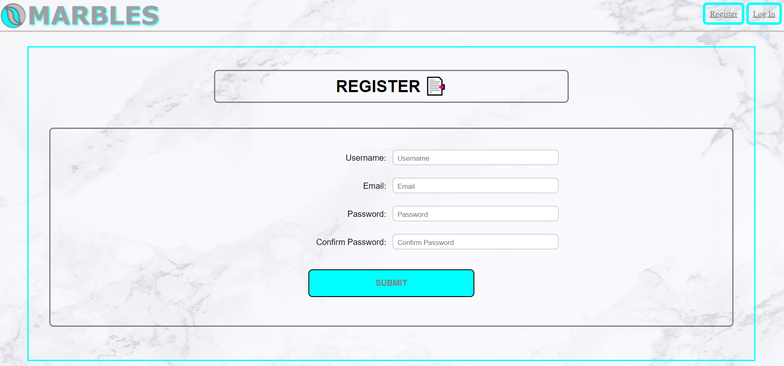
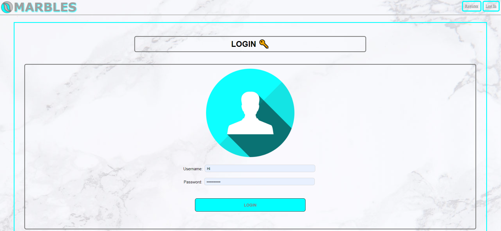
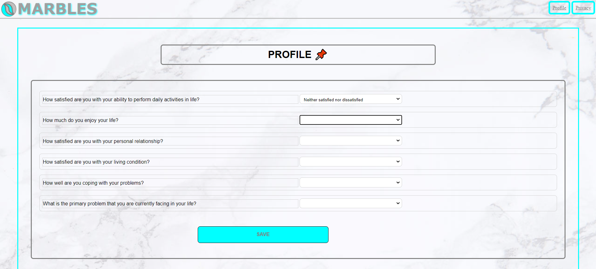
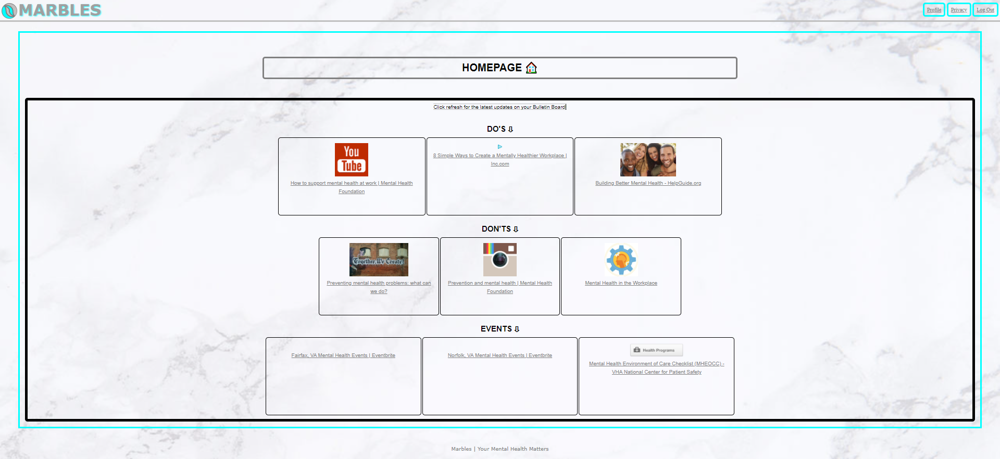
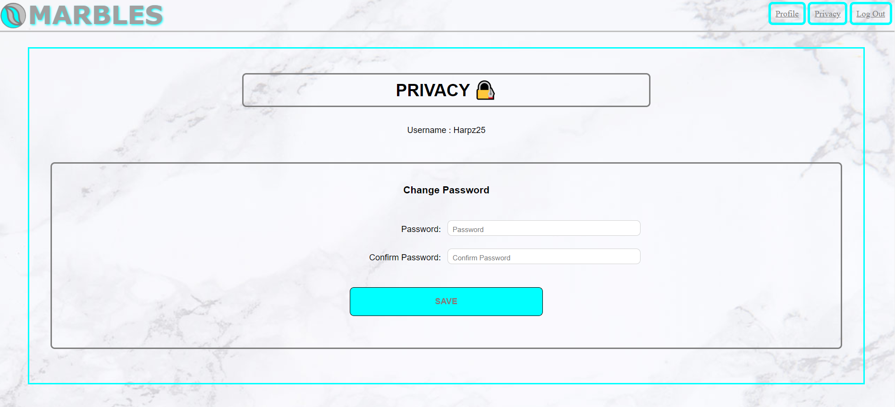
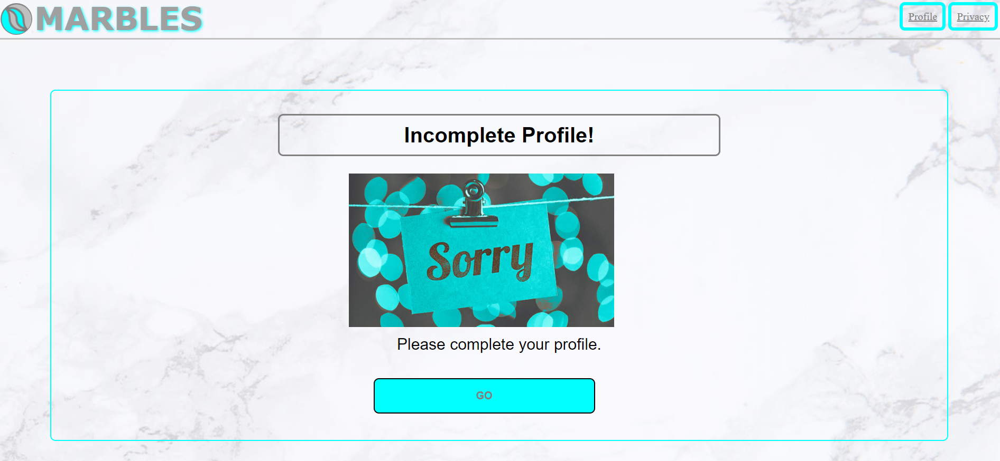
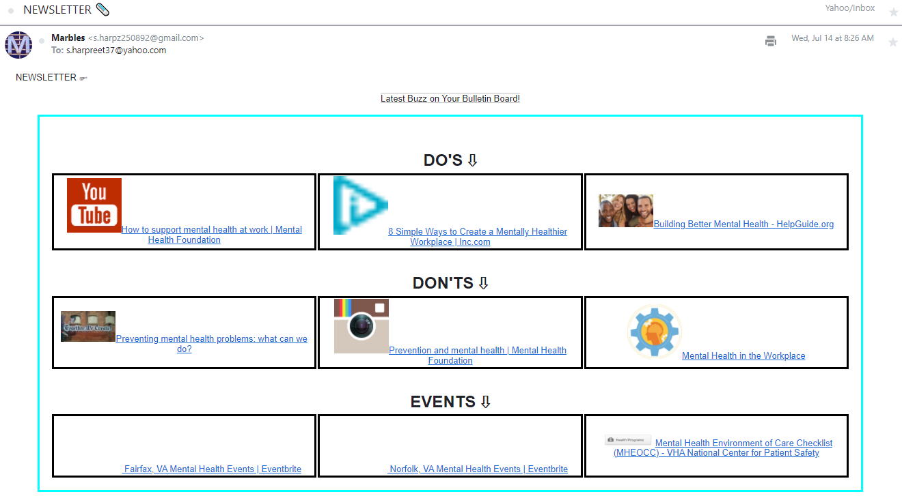

# Marbles

## Introduction:
Marbles main objective is to help users improve their mental health by keeping them inform through newfound online recommendations based on their conditions.


#### Video Demo: < https://youtu.be/pwULdGga-eU >
---
<p align="center" >

</p>

## Description:
Marbles is a web application using flask framework that focus on improving mental health of users by automatically searching for online recommendations based on their respective profile. It also sends corresponding newsletter through email as more convenient way to keep user informed on the websites that have been suggested.


### User Guide:
Screenshots as shown below are zoom out to fit the page,actual display may differ.

#### Register

User will need to enter their username of choice, email and password. All fields are mandatory and failure to fill in any of those fields will direct user to apology page. Successful registration will direct user to login page.

#### Login

User will then enter their username and password. All fields are mandatory and failure to fill in any of those fields will direct user to apology page. Successful login will direct user to homepage.

#### Profile

For new registrants, they will be redirected to profile page whereby they will need to fill in short questionnaire regarding their mental health status.All fields are mandatory and failure to fill in any of those fields will direct user to apology page. Completion of questionnaire will direct user to homepage.

#### Homepage

Here the user will view their own concise 3x3 bulletin board whereby there is 3 latest online recommendations for 3 different sections consist of what to do, what not to do and events relative to their concerns. The aim of these recommendations is to aid user in improving their mental health. Each box consists of random image from the website and website title which is clickable to direct user to the particular website. The user will able to click refresh to get different list of recommendations. On top right corner, the user can navigate to privacy or profile page. The user may leave the website by clicking the logout button placed on top rightmost corner.

#### Privacy

The user can change their password here. All fields are mandatory and failure to fill in any of those fields will direct user to apology page. Once saved successfully the user will be redirected to homepage.

#### Apology

This page will informed users for any occurrence of a particular error and redirect button will be provided.

#### Newsletter

User will received simplified version of the bulletin board with every list of suggested websites in their registered email instantaneously. They also able to click the links directly from the newsletter.

### Methodology:
Methods that are primarily used in this project comprised of web scraping, web framework(flask), relational database management and ajax application. In the mental health field, secondary research method is used based on World Health Organization Quality of Life Instruments (WHOQOL-BREF).

#### Web scraping (Python)
`websearch()` function located in helpers.py takes the argument of a string. The string composed of multiple keywords concatenated together to give search query that can be utilized by google search engine. There are 2 sets of keywords, the first set contain predefined keywords that correspond to each search intent(Do's, Don'ts and Events) and second set which contain possible keywords that correlate with responses provided by the user in profile webpage. The second set of keywords is saved to the keywords table in marbles SQL database. In this project,`googlesearch.search()`function is used to google the search queries because it will return list of search results. Both *urllib.request module*  and *Requests library* is used to retrieve HTML information from the queried websites. All HTML information obtained from the web search results is compiled into list of dictionaries so that it can be accessed with ease using jinja template.`requests.get()` method is used to remove any link with response status code 403(forbidden client error) upfront to avoid error in running `websearch()` function. User agent is used in the request header to avoid from getting HTTP 403 response status code from certain websites that restrict web crawler. `urlopen()` method return sequence of bytes and can be render into UTF-8. `BeautifulSoup()` function is used to parse HTML documents.
PDF links is removed to avoid interruption when encoding to UTF-8.
`urljoin()` method is used to concatenate strings of url website with image source in order to get the absolute file path for the image. Exceptions handling is used to handle attribute error associated with elements in HTML and index error associated with lists in Python.  `Random choice()` method is used to give random element from the list.

#### Web framework (Flask)
In this project, Flask application is used as web framework in python. Features in flask allowed use of session and newsletter mailing by utilizing *Flask-Mail library* and *Flask-Session library* to some extent. In flask mail application, `getenv()` function is used to retrieve sensitive information such as personal email address and password that is purposely stored in external environment(.env file). The mail body is configured to send newsletter HTML page in which the layout is designed separately from the rest of HTML pages which are standardize together using jinja template. This adjustment is mainly to suit the HTML format set by most web-based email providers. Internal style sheet is used instead of external style sheet and pixel is used as measurement unit instead of rem unit. In flask session application, the query for user username and password from marbles SQL database will return all stored information about the user. The query result will also include the ID of the user and will be used to assign user session ID. Session ID will be required for all flask routes using login required decorator except for login,logout and registration route. In helpers.py, decorator is wrapped using `functools.wraps()` function to extend the functionality beyond its existing purpose by adding login capability.

#### Web design (CSS)
Flex layout is primarily used in designing the web layout. In styles.css positioned as an external style sheet, html selector is used to place background image as html element provide the actual height of web browser. Rem unit is mainly used in sizing as it is relative to the html element thus it create consistency in web design for multiple web pages meanwhile em unit is only relative to the parent element. Viewport height(vh) unit is also used as it have the responsiveness in maintaining website layout across different screen resolutions. Percent is used to calibrate the child elements with their parent container to maintain responsiveness. For screen with viewpoint of 640 pixels wide(width estimation of mobile with portrait display) the web layout will use media style suited for portrait design. Main colour scheme for Marbles website are silver(#c0c0c0), gray(#808080) and cyan(#00ffff).

#### Ajax web application (JavaScript)
In apology.js,`myfunction()` function uses AJAX implemented in javascript to inform user on specific error resulting in authentication failure. This is done by updating the div area of apology.html with segments of incomplete HTML documents located in the static folder. These segment only have the content part of HTML page structure as its only purpose is to update that particular area and composed of error messages and return button. Ajax is useful in this context as it avoid the need to load multiple HTML pages for all the possible errors.

#### Psychology questionnaire (WHOQOL-BREF)
Main purpose of user profiling is to identify problems impacting the user's mental health and their current mental health status. In profile.html, quality of life questionnaire will be used in which the user responses will be assessed and corresponding keywords will be generated to provide relevant search queries. WHOQOL-BREF| World Health Organization Quality of Life Instruments(WHOQOL-BREF) is used as guidance material because it gives the following advantages.

Advantages of using WHOQOL-BREF:

 * Assessment with cross-cultural validity (tested with different  culture all over the globe)
 * Have good degree of validity and reliability
 * Take shorter time in conducting assessment (in comparison with other QOL assessments)

Responses will be divided into 3 parts:

1. WHOQOL-BREF related questions
   * Domain for response with the lowest value will be used as primary keyword.In the event there is 2 or more responses with lowest value then move to part 2.

2. General question on primary problem
   * If keyword failed to be generated in part 1, then the response here will be used as keyword.

3. General question on coping problem
   * If the value of the response provided is less than 3, then another keyword will be added together with the primary keyword.

Sample Question:
```plaintext
---Part 1 = WHOQOL-BREF based questions---

1. Physical health
--> How satisfied are you with your ability to perform daily activities in life?

2. Psychological
--> How much do you enjoy your life?

3. Social relationship
--> How satisfied are you with your personal relationship?

4. Environment
--> How satisfied are you with your living condition?

---Part 2 = General questions---

5. How well are you coping with your problems?

6. What is the primary problem that you are currently facing in your life?
```

In part 1, 5 point Likert scale is used to measure the level of satisfaction in accordance with survey response scale from WHOQOL-BREF and the responses are assigned with value from 1 to 5 relative to the scale. The scale ranged from Very dissatisfied, Dissatisfied, Neither satisfied nor dissatisfied, Satisfied and Very satisfied. For part 1 question 2, the scales ranged from Not at all, A little, A moderate amount, Very much and An extreme amount. In part 2, the scale ranged from Very poor, Poor, Fair, Good, Very good. The ranking for the survey scale is standardized for all the questions to
provide consistent measurement of responses. The primary problem question in the end is to address any outstanding problem that client may have and narrowing down possible factors. The responses will be recorded and evaluated to generate relevant keywords.


### Requirements:
Technology used in this project primarily based on libraries and modules made for python. In mental health field, psychological instruments is used as guidance material for user profiling.

1. General
   * SQLite
   * cs50 (Harvard cs50 IDE)
   * functools
   * Werkzeug

2. Web scraping
   * urllib.request
   * urllib.parse
   * googlesearch-python
   * bs4 (Beautiful Soup 4)
   * random
   * Requests

3. Web framework
   * Flask
   * Flask-Session
   * flask-mail
   * python-dotenv

4. Questionnaire
   * World Health Organization Quality of Life Instruments (WHOQOL-BREF)

### Acknowledgements:

I'm grateful to cs50X by HarvardX for providing me the platform through CS50 IDE in order for me to create my web application project. Special thanks to David J.Malan,lead professor at cs50X and his colleagues for the wonderful lessons through the course.


